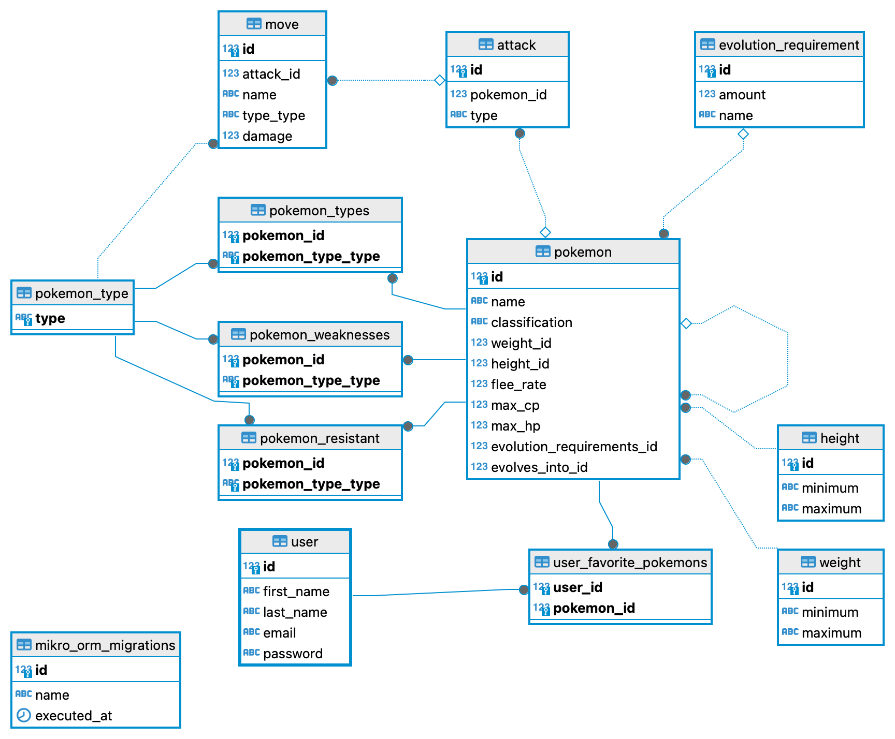

# Pokemon backend API
This project contains a Node.js API backend that serves a catalog of Pokemons. This could be used together with a Frontend application that displays the Pokemons and let users set their favorite Pokemons.

## Pre-requisites
Following programs must be installed to be able to run the API locally:
* Docker
* Docker Compose

## Installation
To install and run the API, run
```
docker compose up
```

## Postman Collection
For convenience, there is a [Postman Collection](Pokemon.postman_collection.json) in the repository that contains all the implemented endpoints. After authenticating using the `/auth` endpoint, the `{{token}}` variable is used in other endpoints to authenticate the requests.

## Swagger Docs
The Swagger docs are exposed on `/swagger` unprotected endpoint. You can [open the Swagger docs](http://localhost:3000/swagger) in your browser and test the API from within the browser.

## Authentication
The Pokemon API is protected with very basic bearer token authentication. The user first needs to authenticate by issuing a POST request to the `/auth` API endpoint. The request body must contain `email` and `password` attributes. For convenience there is already one user in the database so calling the `/auth` endpoint with following request body will successfully authenticate this user and return his bearer token.
```
{
  "email": "testuser@example.com",
  "password": "supersecret"
}
```
Use this token as a bearer token for calling protected API endpoints.

The authentication uses JWT token to store information about the authenticated user. The token is signed with a private key (string value) and it contains basic information about the user.

Example:
```
{
  "id": 4,
  "firstName": "Test",
  "lastName": "User",
  "email": "testuser@example.com",
  "iat": 1719147809,
  "exp": 1719151409
}
```
The token has certain validity period (currently set to one hour). After that time, the token is no longer valid and authentication fails. User must re-authenticate to get fresh token.

[`jsonwebtoken`](https://www.npmjs.com/package/jsonwebtoken) NPM library is used for JWT token handling (to sign and to verify the signature).

## Endpoints

### Pokemons
The main endpoint. It is a set of CRUD endpoints for getting, creating, modifying and deleting pokemons. 
POST `/pokemons` endpoint only supports creating new pokemons. It does not support linking them to their evolutions. This is mainly because during pokemon creation, the other pokemon might not already exist. Setting up the relationships between pokemons is supported by the PATCH operation.
PATCH `/pokemons/{pokemonId}` endpoint supports modifications of the pokemon. One or more attributes can be updated. This endpoint also supports providing `evolvesInto` attribute which creates the evolution link between pokemons. DELETE `/pokemons/{pokemonId}` performs CASCADE delete of the particular pokemon. GET `/pokemons` endpoint supports pagination and searching by Pokemon's name.

### Users
CRUD endpoints for User manipulations.

### Pokemon types
Endpoint to list pokemon types.

### Favorite pokemon
This endpoint lists, sets and removes user's favorite pokemons. The current user is taken from the bearer token.

### Authentication
The `/auth` endpoint is used for authentication.

## Technical details

### Database schema



Database tables are created using `mikroorm` migrations. The data is then seeded using `mikroorm` seeders. One test user is created, Pokemon types and all the Pokemons are populated into the database.

### Pokemon Evolutions
I decided to only include "Evolves Into" relation to the Pokemon database entity. One Pokemon can have one (or none) relation to itself which represents the "Evolves Into" relation. This is enough to calculate all the Pokemon evolutions as well as their previous evolutions.

The `EvolutionCacheService` is responsible to cache one next evolution and one previous evolution for each Pokemon. This cache is populated on server start and refreshed on every Pokemon update. Then, when the API returns Pokemon(s), it traverses through the `pokemonsEvolutionsCache` to get all the evolutions and all the previous evolutions for that particular Pokemon.

### Sample data consistency
I found something that I believe is a mistakes in the `pokemons.json` test data file. The #39 _Jigglypuff_ Pokemon evolves into itself. I think instead, _Jigglypuff_ should evolve into pokemon #40 _Wigglytuff_. I have made that correction in the `pokemons.json` file in my repository.

### Request and response validation
Request and response validation is managed by `fastify-openapi-glue` library (delegating the actual validation to the Fastify server if I am not mistaken). It takes the validation rules from the OpenAPI specification.

### Structure of the project
I decided to structure the project by features (authentication, pokemon, user, ...) because I believe it is a good practise. Each feature contains related entities, controllers and services. For simplicity I decided to go with "Active record" design pattern, where entities also contain additional methods to add additional features. I kept most of the business logic in controllers but ideally the business logic should be moved to services.

### NPM libraries
Aside from libraries suggested in this coding challenge description, I decided to use following libraries that I find usefull:

* [convict](https://www.npmjs.com/package/convict) - to simplify application configuration
* [fastify-openapi-glue](https://www.npmjs.com/package/fastify-openapi-glue) - to bind Fastify web server with OpenAPI specification. It adds routing based on API spec, security handling and request and response validation.
* [jsonwebtoken](https://www.npmjs.com/package/jsonwebtoken) - to sign and validate signature of JWT tokens. Used in the bearer token authentication
* eslint, prettier - to watch the code quality
* [Volta](https://volta.sh/) - to handle the same Node.js version accross workstations


### Technologies used
By selecting PostgreSQL, MikroORM and Fastify technologies for my project I did not want to express that my  interest is only in Big AI Models projects. I selected these technologies mainly because I wanted to explore new ORM library (MikroORM) and because I wanted to gain more experience with Fastify server.

I followed the MikroORM set-up tutorial to get started quickly with MikroORM and to get more familiar with it. Some project design decisions were impacted by that. Then I added other libraries and implemented the business logic. I used a "Design first" approach where I first specified the API endpoints in the OpenAPI specification and then implemented the code to satisfy the interface.

## Things to improve
This section contains items that were not completelly implemented or were skipped entirely. I wanted to list them here for awareness.

### Authentication
There is no session handling implemented. Users can also authenticate as many times in parallel as they want. The authentication token has expiry time and when that passes, the token is expired and user needs to re-authenticate. Since the sessions are not stored anywhere, it is not possible for the user to log out or for the administrator to revoke somebody's token. The authenticated session ends when the token expires.
Another thing to improve is the JWT token signing. Currently the token is signed using secret key which is a string value. In real life private and public key pair should be used for JWT token signature and verification.

### Password hashing
For simplicity, SHA-256 hashing algorithm was picked to hash user passwords. However, for production use, I would propose to use some other hashing algorithm like for example `bcrypt`. As that algorithm is more suitable for password hashing and more difficult to crack (it is computationally slower than SHA-256).

### Error handling and reporting
Fastify's error reporting is too verbose. For example SQL error is returned together with the whole query:
```
{
    "statusCode": 500,
    "code": "SQLITE_CONSTRAINT",
    "error": "Internal Server Error",
    "message": "insert into `user` (`first_name`, `last_name`, `email`, `password`) values ('Tomas', 'Test', 'mujemail@example.com', 'dd1b8ad5f9aba3225ff5052973f24043bbabb9594c077d83f8ea766776500ade') returning `id` - SQLITE_CONSTRAINT: UNIQUE constraint failed: user.email"
}
```
That is not acceptable for production environment. The error message must not expose any details of the application. Such verbose error reporting would need to be disabled for production.

### Evolutions Cache
Pokemon Evolutions cache should be improved as currently it only caches one next evolution and one previous evolution of each Pokemon. The whole evolution chain for Pokemon is then calculated ad-hoc when Pokemon is requested. This should be improved so that the evolution chain for each Pokemon should be calculated up-front and stored in the cache.

### Typings
As I have not been working with Fastify server too much yet, I am not very familiar with how typing works there. Therefore I am missing some types (for example in the handler functions - req, reply, ...) and using `any` instead. It is a bad practice and it should be fixed by correctly typing all the variables.

### Eslint & prettier
The eslint and prettier configuration is probably not 100% correct. I am seeing some warnings when running `yarn install`. Also, I am seeing the issues reported twice in VSCode editor. Although both eslint and prettier seem to work and I am able to view and fix any issues in VSCode or in the cli using `yarn eslint`.

### Code documentation
In a real life product I would pay much more attention to add thorough JSDoc documentation to the code.

### Dependency management
The dependecy management is not ideal in the current implementation. It is starting to become quite complicated. Some dependency injection solution would probably be needed to organize the dependencies better.

### Tests
Unfortunately, I was not able to add any tests. I did face issues when trying to configure Jest running with ESM modules. I was getting errors from the `fastify-openapi-glue` library and I was not able to spin up the fastify server. I tried mocking the resources using `sinon` library but was not successful either because of the not very ideal dependency structure of the project.

Next time I would definitely spend more time designing the structure of the application and all the dependencies so that the application is more testable.

## Conclusion
I really enjoyed this coding challenge. It was a nice exercise with interesting topic - Pokemons. I am pretty happy with the result. The application fulfills all the requirements, is correctly working and is easy to spin up and run.

Along the way I was facing couple of hiccups that slowed me down. Mostly when working with MikroORM library, because it was my first time using this ORM library. Also unfortunately I was not successful properly configuring Jest testing library and adding tests for the application.
